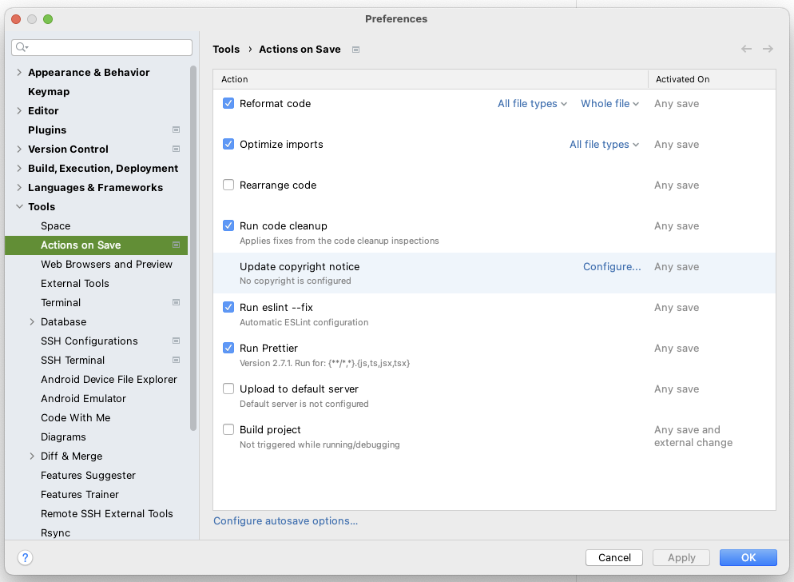

# Eslint

## Commands

Tries to automaticly fix all .es6|.ts|.jsx files based on .eslintrc

`npm run lint`

Same as lint, but doesn't fix the files, just creates the error/warning dump in console

`npm run lint-dry`

## Setup

### Common to all editors

We use the [.editorconfig](/.editorconfig) file to set up a common configuration across all editors that support this
format. For the time being you need to install a plugin for VSCode or Sublime Text, but IntelliJ reads this format
natively and does not need one.

- [Sublime text plugin](https://github.com/sindresorhus/editorconfig-sublime#readme)
- [Visual Studio Code plugin](https://marketplace.visualstudio.com/items?itemName=EditorConfig.EditorConfig)
- [Vim plugin](https://github.com/editorconfig/editorconfig-vim#readme)

### Visual Studio Code

#### Install Eslint Plugin:

> Name: ESLint    
> Id: dbaeumer.vscode-eslint    
> Description: Integrates ESLint JavaScript into VS Code.    
> Version: 2.0.14    
> Publisher: Dirk Baeumer    
> VS Marketplace Link: https://marketplace.visualstudio.com/items?itemName=dbaeumer.vscode-eslint\

Update VSCode workspace- or userconfig:

```
  "eslint.enable": true,
  "editor.codeActionsOnSave": {
      "source.fixAll.eslint": true
  },
```

If you don't want it to automaticly lint the current file on save, omit the `codeActionsOnSave` config

#### Install Prettier plugin

Prettier works in tandem with ESlint: ESlint does code styles and Prettier does formatting, whitespace etc. We use both
of them, they are configured to not cause conflicts. You can read more about this
configuration [here](https://www.robinwieruch.de/prettier-eslint/), and in the related articles.

> Name: Prettier - Code formatter    
> Id: esbenp.prettier-vscode    
> Description: Code formatter using prettier    
> Version: 9.9.0
> Publisher: Prettier    
> VS Marketplace Link: https://marketplace.visualstudio.com/items?itemName=esbenp.prettier-vscode

### IntelliJ

Install the
[Prettier plugin for IntelliJ. Instructions can be found here](https://plugins.jetbrains.com/plugin/10456-prettier).

After installation, make sure you configure IntelliJ to reformat and fix on save.
A configuration like this seems to do the trick, adjust for taste:    


### General configuration

Eslint is setup to lint .es6, .ts, and .jsx files. Each of these share one [common config](/common.eslintrc.json), with
overrides in [.eslintrc.json](/.eslintrc.json)

[Eslint rules documentation](https://eslint.org/docs/rules/)<br>
[Typescript rules documentation](https://github.com/typescript-eslint/typescript-eslint/tree/master/packages/eslint-plugin#supported-rules)<br>
[React rules documentation](https://github.com/yannickcr/eslint-plugin-react/#list-of-supported-rules)<br>

If you want to add specific rules to either .es6, .ts or .jsx, then you'll have to do this
inside [.eslintrc.json](/.eslintrc.json). For .es6, add `"rules": { /*my rules */ }` to the root object. For .ts or
.jsx, add it to the respective overrides.rules objects.
